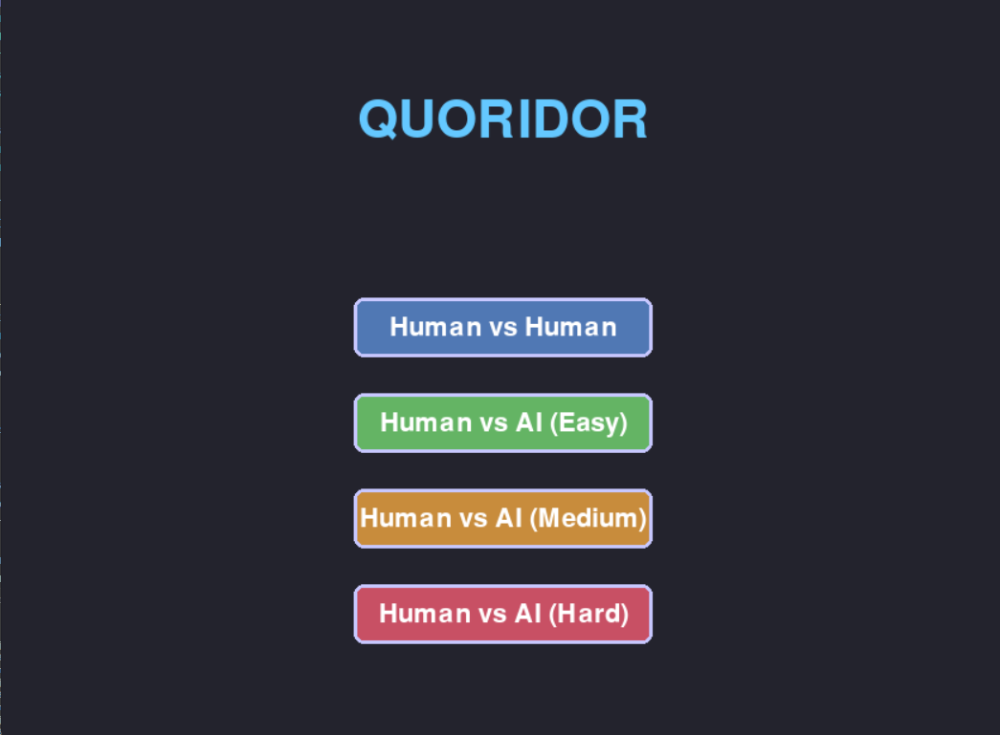
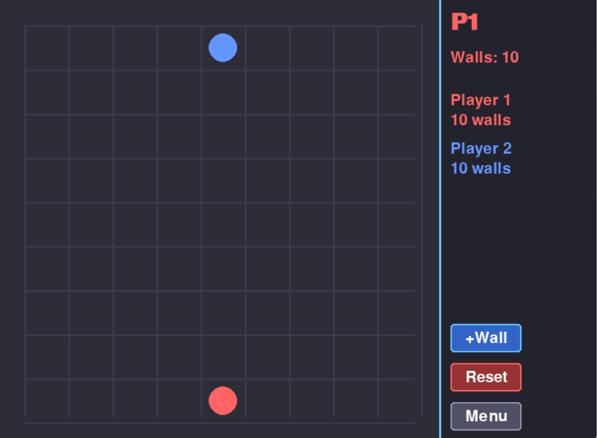

# Quoridor — CSE472s Term Project

A fully-featured implementation of the abstract strategy board game **Quoridor**, built in Python with Pygame. Play against a friend locally or challenge an AI opponent at three difficulty levels.

---


Submitted by:
[Menna Ayman Hassan Radwan — 2200236]

[Khaled Abdelghafar Mohammed Ahmed — 2300421]

[Abdullah mohamed ahmed — 2200423]

[George Joseph— 2100261]


## Table of Contents

- [Game Description](#game-description)
- [Screenshots](#screenshots)
- [Features](#features)
- [Project Structure](#project-structure)
- [Installation](#installation)
- [Running the Game](#running-the-game)
- [Controls](#controls)
- [AI Opponents](#ai-opponents)

---

## Game Description

Quoridor is an award-winning abstract strategy board game invented by Mirko Marchesi (1997). Two players race to move their pawn across a 9×9 board to the opposite side, while strategically placing walls to slow each other down.

**Core rules:**

- Each player starts at the center of their base row (row 8 for Player 1, row 0 for Player 2).
- On each turn a player must either **move their pawn** or **place a wall**.
- Pawns move one square orthogonally. If pawns are adjacent, you may jump over the opponent (subject to wall blocking).
- Walls are two cells long and may not overlap, cross, or completely cut off either player's path to their goal.
- Each player has **10 walls** to place during the game.
- **First player to reach any cell on the opposite side wins.**

---

## Screenshots

| Main Menu | Gameplay |
|-----------|----------|
|  |  | 

---

## Features

- **Complete Quoridor ruleset** — pawn movement, orthogonal jumping, diagonal escape, wall placement, path-blocking detection
- **Two game modes** — Human vs. Human and Human vs. Computer
- **Three AI difficulty levels** — Easy (random), Medium (shallow minimax), Hard (deep minimax with alpha-beta pruning)
- **Valid move highlighting** — legal pawn destinations shown on click
- **Wall legality enforcement** — BFS path-check prevents walls that would fully block a player
- **Real-time HUD** — turn indicator, wall counts, game status messages
- **Win detection and game reset**

---

## Project Structure

```
quoridor/
├── main.py                  # Entry point — initialises Pygame and starts the game loop
│
├── game/                    # Pure game logic (no UI, no AI)
│   ├── GameState.py         # Board state: pawn positions, walls, turn tracking
│   ├── MoveValidator.py     # Legal pawn moves including jumps and diagonal escapes
│   ├── WallManager.py       # Wall placement, overlap/crossing checks, blocking check
│   └── PathFinder.py        # BFS shortest-path and reachability for both players
│
├── ui/                     
│   ├── GameBoard.py         # Board grid, pawn sprites, wall rendering, move highlights
│   ├── PlayerHUD.py         # Wall counters, turn indicator, status messages
│   └── Menu.py              # Main menu: mode selection, difficulty picker
│
├── ai/                      # Computer opponent
│   └── QuoridorAI.py        # Minimax with alpha-beta pruning, three difficulty levels
│
├── tests/                   # Unit tests
│   ├── GameStateTest.py
│   └── aiPlayerTest.py
│
├── assets/       # Game screenshots for README
│
├── requirements.txt
├── .gitignore
└── README.md
```

---

## Installation

### Prerequisites

- Python **3.10** or higher
- pip

### Steps

```bash
# 1. Clone the repository
git clone https://github.com/the3miaphysite3engineer3/ai-project.git
cd quoridor

# 2. (Recommended) Create a virtual environment
python -m venv venv
source venv/bin/activate        # macOS / Linux
venv\Scripts\activate           # Windows

# 3. Install dependencies
pip install -r requirements.txt
```

---

## Running the Game

```bash
python main.py
```

The main menu will appear. Choose a game mode and, for Human vs. Computer, select a difficulty level before starting.

---

## Controls

### Pawn Movement

| Action | Control |
|--------|---------|
| Select your pawn | Left-click on your pawn |
| Move to a highlighted cell | Left-click the destination cell |
| Deselect | Left-click anywhere else |

### Wall Placement

| Action | Control |
|--------|---------|
| Switch to wall-placement mode | Press **W** |
| Preview a horizontal wall | Hover over a wall slot |
| Rotate wall orientation | Press **R** (toggle horizontal ↔ vertical) |
| Place the wall | Left-click the highlighted slot |
| Cancel / switch back to pawn mode | Press **Escape** |

### General

| Action | Control |
|--------|---------|
| Reset the game | click the **Reset** button |
| Return to main menu | click **Escape** or press menu from the game screen |
| Quit | Close the window |

---

## AI Opponents

The computer opponent is built on the **Minimax algorithm with alpha-beta pruning**.

| Difficulty | Behaviour | Search Depth |
|------------|-----------|-------------|
| **Easy** | Picks a random legal move every turn | — |
| **Medium** | Minimax with basic heuristic (path length difference) | 2 ply |
| **Hard** | Minimax + alpha-beta pruning, stronger heuristic | 4 ply |

**Heuristic formula (Medium / Hard):**

```
score = opponent_shortest_path − my_shortest_path
```

A positive score means the AI is ahead. The AI tries to maximise this value by both shortening its own path (moving toward the goal) and lengthening the opponent's path (placing walls). Shortest paths are computed by the BFS in `PathFinder.py`.

